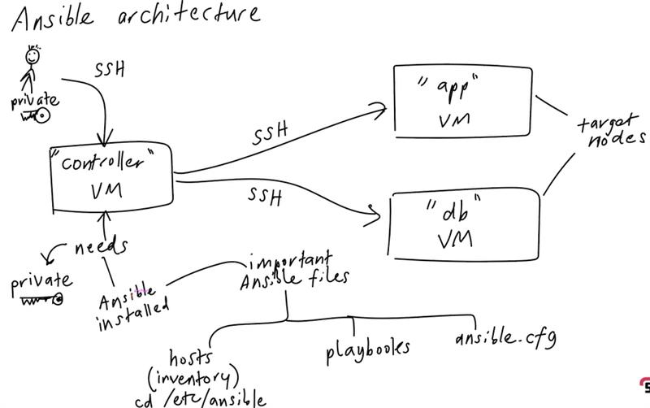
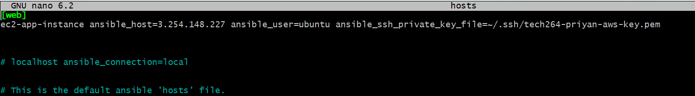
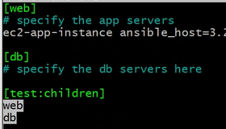

# Infrastructure as Code (IaC)

- [Infrastructure as Code (IaC)](#infrastructure-as-code-iac)
  - [What is IaC?](#what-is-iac)
  - [Benefits of IaC](#benefits-of-iac)
  - [When/Where to use IaC](#whenwhere-to-use-iac)
  - [What are the tools available for IaC?](#what-are-the-tools-available-for-iac)
  - [What is Configuration Management (CM)?](#what-is-configuration-management-cm)
  - [What is provisioning of infrastructure? Do CM tools do it?](#what-is-provisioning-of-infrastructure-do-cm-tools-do-it)
  - [What is Ansible and how does it work?](#what-is-ansible-and-how-does-it-work)
    - [Key Features:](#key-features)
  - [Who is using IaC and Ansible in the industry?](#who-is-using-iac-and-ansible-in-the-industry)
  - [Diagram for Ansible architecture.](#diagram-for-ansible-architecture)
- [Steps for Ansible Architecture](#steps-for-ansible-architecture)
  - [1. Create Two Instances on AWS](#1-create-two-instances-on-aws)
    - [Ansible Controller Instance:](#ansible-controller-instance)
    - [Ansible Target Node Instance (will run the app):](#ansible-target-node-instance-will-run-the-app)
  - [2. Connect to Instances](#2-connect-to-instances)
  - [3. Set Up Ansible on the Controller Instance](#3-set-up-ansible-on-the-controller-instance)
  - [4. Configure Ansible Hosts](#4-configure-ansible-hosts)
  - [5. Create and Run an Ansible Playbook to Install NGINX](#5-create-and-run-an-ansible-playbook-to-install-nginx)
- [Steps to install terraform](#steps-to-install-terraform)
- [Terraform](#terraform)
  - [What is Terraform?](#what-is-terraform)
    - [What is Terraform used for?](#what-is-terraform-used-for)
  - [Why use Terraform? The Benefits](#why-use-terraform-the-benefits)
    - [Key Benefits of Terraform:](#key-benefits-of-terraform)
  - [Alternatives to Terraform](#alternatives-to-terraform)
  - [Who is Using Terraform in the Industry?](#who-is-using-terraform-in-the-industry)
  - [What is Orchestration in IaC?](#what-is-orchestration-in-iac)
    - [How Does Terraform Act as an Orchestrator?](#how-does-terraform-act-as-an-orchestrator)
  - [Best Practice: Supplying AWS Credentials to Terraform](#best-practice-supplying-aws-credentials-to-terraform)
    - [AWS Credentials Lookup Order in Terraform:](#aws-credentials-lookup-order-in-terraform)
    - [Best Practice to Supply AWS Credentials:](#best-practice-to-supply-aws-credentials)
    - [How AWS Credentials Should **Never** Be Passed to Terraform:](#how-aws-credentials-should-never-be-passed-to-terraform)
  - [Why Use Terraform for Different Environments (Production, Testing, etc.)](#why-use-terraform-for-different-environments-production-testing-etc)
    - [Benefits:](#benefits)
- [Steps to install terraform](#steps-to-install-terraform-1)
- [Launching an EC2 instance using terraform](#launching-an-ec2-instance-using-terraform)
- [Terraform](#terraform-1)
  - [Terraform GitHub Repository Automation](#terraform-github-repository-automation)
  - [Goal](#goal)
  - [Steps](#steps)
    - [Repository Link](#repository-link)


## What is IaC?
* Infrastructure as Code (IaC) is the process of managing and provisioning computing infrastructure through machine-readable configuration files, rather than through physical hardware configuration or interactive configuration tools. 
* IaC allows for automation of infrastructure management, ensuring consistency and reducing human error.

## Benefits of IaC
- **Automation**: Reduces the need for manual intervention by automating the provisioning and management of infrastructure.
- **Consistency**: Ensures that infrastructure is provisioned in a repeatable and reliable manner.
- **Version Control**: Infrastructure definitions can be stored in version control systems, allowing for easy rollbacks and tracking of changes.
- **Scalability**: Facilitates the quick and efficient scaling of infrastructure based on demand.
- **Cost Efficiency**: Reduces overhead and operational costs by minimizing human error and streamlining processes.

## When/Where to use IaC
- **Cloud environments**: When managing cloud infrastructure like AWS, Azure, or Google Cloud.
- **Large-scale infrastructure**: To efficiently manage and provision many servers or resources.
- **CI/CD pipelines**: When infrastructure needs to be provisioned automatically for continuous integration and deployment processes.
- **DevOps practices**: When teams are practicing DevOps and need to unify development and operations workflows.

## What are the tools available for IaC?
- **Terraform**: A declarative tool that works across multiple cloud providers.
- **AWS CloudFormation**: An IaC tool specific to AWS environments.
- **Azure Resource Manager (ARM)**: The IaC tool for managing resources on Azure.
- **Google Cloud Deployment Manager**: IaC tool for provisioning Google Cloud infrastructure.
- **Pulumi**: Supports various languages for infrastructure definitions.
  
## What is Configuration Management (CM)?
* Configuration Management (CM) is the process of systematically handling changes to ensure consistency over time. 
* It involves maintaining system settings, software versions, and configurations to avoid unexpected behavior in infrastructure.
* **Tools**: Puppet, Chef, Ansible.

## What is provisioning of infrastructure? Do CM tools do it?
* Provisioning of infrastructure refers to the process of setting up necessary computing resources (such as servers, databases, networks, etc.) for an application or system. 
* Tools like Terraform can provision infrastructure.
* CM tools like Ansible, Puppet, and Chef can provision infrastructure, but their primary focus is on managing configurations and keeping the infrastructure in a desired state.

## What is Ansible and how does it work?
* Ansible is an open-source automation tool used for configuration management, application deployment, and infrastructure provisioning. 
* It works by using a simple language (YAML) to describe tasks, which it then runs over SSH, without the need for an agent to be installed on the remote systems. 
* Ansible uses a 'push' model, where the controlling node pushes the configurations to the target nodes.

### Key Features:
- **Agentless**: No need to install software on target machines.
- **Idempotent**: Ensures that applying the same configuration multiple times will result in the same outcome.
- **Easy-to-learn syntax**: Uses YAML, a human-readable data serialization standard.

## Who is using IaC and Ansible in the industry?
- **Tech companies** like Google, Facebook, and Netflix use IaC to scale their massive infrastructure automatically.
- **Enterprises** like banks, e-commerce platforms, and health-tech companies use Ansible to automate their operations.
- **Startups** also leverage IaC to quickly deploy and manage their cloud infrastructure.

## Diagram for Ansible architecture.


This diagram plans everything. 


# Steps for Ansible Architecture

## 1. Create Two Instances on AWS

### Ansible Controller Instance:
- **Name**: `tech2xx-priyan-ubuntu-2204-ansible-controller`
- **Security Group**: Allow SSH port
- **Key Pair**: Use the key pair you typically use for AWS instances
- **Image**: Ubuntu Server 22.04 LTS (free tier eligible)
- **Additional Setup**: Leave user data and scripts blank; do not run any.

### Ansible Target Node Instance (will run the app):
- **Name**: `tech2xx-priyan-ubuntu-2204-ansible-target-node-app`
- **Security Group**: Allow SSH, HTTP, and port 3000 (typical for app)
- **Key Pair**: Use the same key pair as for the controller instance
- **Image**: Ubuntu Server 22.04 LTS (free tier eligible)
- **Additional Setup**: Leave user data and scripts blank; do not run any.

---

## 2. Connect to Instances

Check that you can SSH into both instances (using Git Bash is recommended).

Update and upgrade each VM:

```bash
sudo apt update -y
sudo DEBIAN_FRONTEND=noninteractive apt upgrade -y
```

---

## 3. Set Up Ansible on the Controller Instance

On the **Controller instance**, run the following commands to install Ansible:

```bash
sudo apt-add-repository ppa:ansible/ansible
sudo apt install ansible -y
```

Place the AWS private key in the `.ssh` folder on the **Controller VM**.

---

## 4. Configure Ansible Hosts

1. Use the ping module to verify that the Ansible controller can communicate with a device specified in the hosts file.

   

2. Open the `hosts` file in the `/etc/ansible/` directory with nano and add the **Target Node**'s public IP address.

   ```bash
   sudo nano /etc/ansible/hosts
   ```

3. **Ping all hosts** in the `hosts` file with this command:

   ```bash
   ansible all -m ping
   ```

   - Use `all` to target every device in the `hosts` file, or specify a particular server or group.
   - Group your servers (e.g., `db` and `app`) with a parent `[test:children]` section in the hosts file.

   

---

## 5. Create and Run an Ansible Playbook to Install NGINX

To create a YAML playbook for NGINX installation:

1. Open a new file:

   ```bash
   sudo nano install_nginx.yml
   ```

2. Use the following playbook content:
``` yaml
---
# Name of the play
- name: install nginx play
  # Where - on which devices - run this playbook
  hosts: web

  # Get comprehensive facts on the hosts / devices
  gather_facts: yes # If you want the playbook to run faster, turn this off using "no"

  # Do we need to provide admin access? Use sudo
  become: true

  # Instructions for this play, known as "tasks"
  # First Task: Install nginx on the Target Node
  tasks:
  - name: install and configure nginx
    # Use "nginx" package // "state=present" means we need it running
    apt: pkg=nginx state=present
```

3. Run the playbook:

   ```bash
   ansible-playbook install_nginx.yml
   ```


# Steps to install terraform 
1) Go on the terraform website and select the **Windows AMD64**.
2) This will download as a zip you can then extract this and add it to a `C:\my-cmd-line-tools`.
3) Search on the search below **Edit System Environment Variables** and add a PATH env variable with the path to the terraform file. 

# Terraform 

## What is Terraform?
* **Terraform** is an open-source Infrastructure as Code (IaC) tool developed by HashiCorp. 
* It allows users to define and provision data center infrastructure using a high-level configuration language called **HashiCorp Configuration Language (HCL)**. Good balance and understandble from machines and humans. 
* **Terraform** manages infrastructure across a wide range of service providers such as AWS, Azure, GCP, VMware, and even on-premise environments.
* **Terraform** is an orchestration tool (infrastructure provisioning tool - creates, deploys, manages and destroys the infrastructure).
* Terraform see infrastructure as **immutable**. 

### What is Terraform used for?
* Terraform is used to automate the process of creating, updating, and versioning infrastructure. 
* By using code, it allows teams to manage infrastructure resources such as virtual machines, networking, and storage in a declarative way. This ensures that infrastructure is always consistent across environments.

---

## Why use Terraform? The Benefits

### Key Benefits of Terraform:
1. **Infrastructure as Code (IaC)**: Treat infrastructure the same way as application code, using version control and best practices.
2. **Multi-Cloud**: Terraform is cloud-agnostic and can manage infrastructure across multiple cloud providers, making it a powerful tool for multi-cloud deployments.
3. **Declarative Syntax**: You define the end state of your infrastructure, and Terraform figures out the necessary steps to reach that state.
4. **Automation**: Automates repetitive manual tasks related to infrastructure management, reducing human error.
5. **Modular and Reusable Code**: Create reusable modules for infrastructure components, enabling easier scaling and management.
6. **State Management**: Terraform stores infrastructure states, which enables you to plan changes and apply only the necessary updates to your environment.
7. **Cloud Agnostic**: Can deploy to any cloud provider because it uses different cloud providers. Each provider maintains their own plugins (e.g. Azure has an Azure plugin in Terraform that will interface with the API of Azure).  
8. **Free?**: We can use it for free commercially. Terraform cannot be used to create a competing product.
9. **Open-Source and Easy to use**. 

---

## Alternatives to Terraform
There are several alternatives to Terraform in the Infrastructure as Code (IaC) space, including:

1. **AWS CloudFormation**: AWS-specific tool for provisioning infrastructure on AWS.
2. **Ansible**: Primarily a configuration management tool but can also manage infrastructure provisioning.
3. **Pulumi**: Similar to Terraform, but allows you to write infrastructure code using general-purpose programming languages (e.g., TypeScript, Python).
4. **Chef/Puppet**: Configuration management tools that can manage infrastructure but are more focused on provisioning applications and environments.
5. **Google Cloud Deployment Manager**: Google Cloud-specific infrastructure provisioning tool.

---

## Who is Using Terraform in the Industry?
Terraform is widely adopted across industries, from small startups to large enterprises, due to its flexibility and multi-cloud capabilities. Some of the industries using Terraform include:

- **Technology companies** (e.g., Slack, Uber, and Shopify) for managing cloud infrastructure.
- **Financial services** for secure and scalable infrastructure deployment.
- **Retail and E-commerce** for provisioning dynamic infrastructure at scale.
- **Media and Entertainment** for managing large-scale content delivery systems.

---

## What is Orchestration in IaC?
* **Orchestration** in Infrastructure as Code refers to the process of coordinating and managing multiple components of infrastructure (e.g., networks, servers, databases) to work together harmoniously. 
* It involves defining the relationships and dependencies between various resources and automating their provisioning and configuration.

### How Does Terraform Act as an Orchestrator?
Terraform acts as an orchestrator by:
1. Defining the desired end state of your infrastructure in code.
2. Automatically determining the correct order in which to provision, modify, or destroy resources, respecting dependencies (e.g., creating a database before deploying an application).
3. Applying changes in a controlled and predictable way, using its built-in plan and apply workflow.

---

## Best Practice: Supplying AWS Credentials to Terraform

### AWS Credentials Lookup Order in Terraform:
Terraform checks for AWS credentials in the following order of precedence (if it can't find from the one it will check the nexxt one on the list):
1. **Environment Variables**: `AWS_ACCESS_KEY_ID` and `AWS_SECRET_ACCESS_KEY`.
    * You would need to set up system variables under **Edit the system environment variables**.
2. **AWS Credentials File**: Located at `~/.aws/credentials`.
3. **Instance Profile**: For EC2 instances running in AWS with an IAM role attached.
4. **Explicit Access in Terraform Config**: Credentials provided directly in the Terraform configuration file (not recommended).

### Best Practice to Supply AWS Credentials:
The recommended approach for securely supplying AWS credentials is through **environment variables** or by using **AWS IAM roles** (for EC2 instances). These methods reduce the chances of exposing sensitive credentials.

1. **Use Environment Variables**: Use `AWS_ACCESS_KEY_ID` and `AWS_SECRET_ACCESS_KEY` as environment variables to provide access.
   - Example:
     ```bash
     export AWS_ACCESS_KEY_ID="your-access-key-id"
     export AWS_SECRET_ACCESS_KEY="your-secret-access-key"
     ```

2. **Use AWS Profiles**: Use profiles defined in the AWS credentials file (`~/.aws/credentials`) and reference them using the `profile` parameter in Terraform.
   - Example:
     ```hcl
     provider "aws" {
       profile = "my-aws-profile"
     }
     ```

3. **Use IAM Roles**: For EC2 instances, assign IAM roles with the necessary permissions. Terraform will automatically detect and use the role without the need for explicit credentials.

### How AWS Credentials Should **Never** Be Passed to Terraform:
- **Do not hard-code credentials** directly in the Terraform files (`.tf` files). This can lead to accidental exposure in version control systems like GitHub.
- **Avoid committing `~/.aws/credentials`** or environment variables with credentials into source control.

---

## Why Use Terraform for Different Environments (Production, Testing, etc.)
* Using Terraform to manage multiple environments (such as **production**, **staging**, and **testing**) allows you to maintain consistent infrastructure across these environments while also adapting to their unique requirements.
* Developers using different environments will cause problems. Having a consistent environment and then that matching environment is used throughout to maintain consistency. 
    * All the dependencies should match. 
    * **Production environment** needs to be scalable so you have more load/instances than **Testing**. 

### Benefits:
1. **Consistency**: Ensures that each environment is created with the same infrastructure code, reducing drift and errors.
2. **Separation of Concerns**: You can use different **Terraform workspaces** or separate configuration files for each environment, ensuring that changes to one environment do not affect others.
3. **Version Control**: You can track infrastructure changes for each environment using a version control system (e.g., Git).
4. **Testing**: Test infrastructure changes in staging or testing environments before applying them to production.

By using Terraform, organizations can automate the provisioning and teardown of environments, enabling faster deployment cycles and reducing human error.

---

# Steps to install terraform 
1) Go on the terraform website and select the **Windows AMD64**.
2) This will download as a zip you can then extract this and add it to a `C:\my-cmd-line-tools`.
3) Search on the search below **Edit System Environment Variables** and add a PATH env variable with the path to the terraform file. 

---
# Launching an EC2 instance using terraform

1. Make environment variables as `AWS_ACCESS_KEY_ID` and `AWS_SECRET_ACCESS_KEY` and store them under **System variables**.
2. Setup your `.gitignore` and add files to ensure that credentials are not being pushed to GitHub. 
3. Create a `main.tf` file this is where you will write your script to deploy the instance. In this script you want to include the following: [Terraform script to launch EC2 instance](main.tf).
4. When you have at least the `provider` in your script you can use `terraform init` in a new git bash window once you have `cd` to the correct directory.
5. Once you have completed the script ([Terraform script to launch EC2 instance](main.tf)). Then you can run `terraform plan` and `terraform apply`. 
6. You can check this and see if your instance has been created on **AWS**. 
7. To terminate this instance you can use: `terraform destroy`.   

---
# Terraform 

## Terraform GitHub Repository Automation

## Goal
Automate the creation of a GitHub repository using Terraform.

## Steps

1. Create a Personal Access Token (PAT) on GitHub with necessary scopes.
   1. Go to **Settings** > **Developer Settings** > **Create Classic Token** > **Select the repo**.
   2. This will generate the token. Make sure to 
2. Store the PAT in environment variables or in `variable.tf`.
3. Configure Terraform with a `main.tf` file to create a GitHub repository.
4. Create a `.gitignore` file to ignore sensitive files.
5. Initialize and apply the Terraform configuration.
6. Verify the repository creation on GitHub.

### Repository Link
[tech264-terraform-create-github-repo](https://github.com/your_username/tech264-terraform-create-github-repo)

   